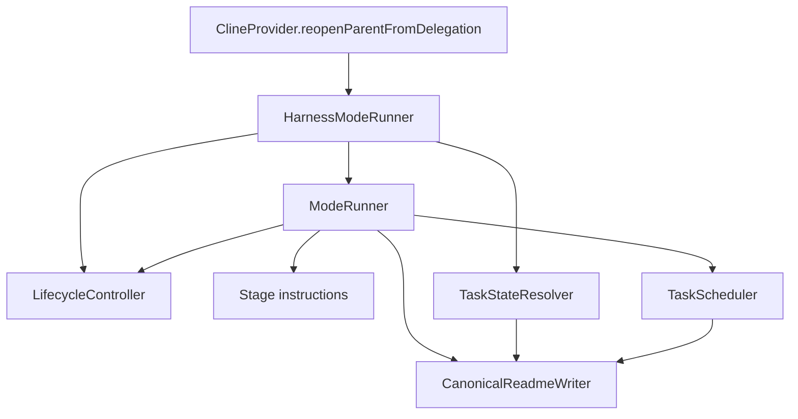

# Harness stage lifecycle model

This document describes the programmatic stage lifecycle that runs a task through its modes
(`architect` → `code` → `refactor` → `reviewer` → `qa`) without asking the model to choose the next
stage. It is a different model from the one in
[`docs/architecture/task-lifecycle-model.md`](task-lifecycle-model.md): that model covers the
persisted `HistoryItem` status of a _task record_ (active / delegated / completed / interrupted)
and is checked by `pnpm lifecycle:model-check`. This model covers the `Status` line of the task
README, which the modes act on. The two are connected only through
`ClineProvider.reopenParentFromDelegation`, which forks between them.

## Layers

| Layer              | Location                                                                                                         | Responsibility                                                                                                   |
| ------------------ | ---------------------------------------------------------------------------------------------------------------- | ---------------------------------------------------------------------------------------------------------------- |
| Integration        | [`ClineProvider.reopenParentFromDelegation`](../../src/core/webview/ClineProvider.ts:4415)                       | After a subtask child completes, delegate the next stage. Falls back to the legacy parent resume on any failure. |
| Adapter            | [`src/core/harness/mode-runner.ts`](../../src/core/harness/mode-runner.ts:21)                                    | Resolve the runtime `TaskContext`, parse the stage report, call the controller, apply the decision.              |
| Domain             | [`packages/core/src/lifecycle`](../../packages/core/src/lifecycle/index.ts:1)                                    | Pure routing (`LifecycleController`), effects (`ModeRunner`), protocol parsing (`parseStageOutcome`).            |
| Stage instructions | [`packages/core/src/lifecycle/stage-instructions.ts`](../../packages/core/src/lifecycle/stage-instructions.ts:1) | The declared artifacts and directive a stage start is composed from.                                             |
| Canonical state    | [`packages/core/src/worktree/task-state.ts`](../../packages/core/src/worktree/task-state.ts:36)                  | The status vocabulary, the failure-tracking fields, and the canonical transition table.                          |
| Canonical I/O      | [`packages/core/src/worktree/task-readme.ts`](../../packages/core/src/worktree/task-readme.ts:1)                 | The only writer of the harness-owned README block.                                                               |
| Stage modes        | [`DEFAULT_MODES`](../../packages/types/src/mode.ts:174)                                                          | The `reviewer`/`qa`/`refactor` modes exist out of the box with their tool capabilities.                          |

## The model has two halves, and they must agree

A stage outcome is only actioned when **both** halves agree:

1. **Preconditions** — `MODE_STATUSES` in [`lifecycle-controller.ts`](../../packages/core/src/lifecycle/lifecycle-controller.ts:24)
   answers "may this mode complete the status the README is currently in?".
2. **Canonical transitions** — `TASK_STATUS_TRANSITIONS` in [`task-state.ts`](../../packages/core/src/worktree/task-state.ts:36)
   answers "is the status we are about to write reachable from the current one?".

`LifecycleController.transition` validates every status it writes against the canonical table before
returning a decision, and a decision that re-writes the current status is treated as a no-op (the
runner skips the file write) instead of inventing self-loop edges. This is the invariant that keeps
the two halves from drifting:

> No status reaches the README unless it is an edge in `TASK_STATUS_TRANSITIONS`.

`schedule_implementation` is deliberately exempt: it defers the write to `TaskScheduler`, which
re-derives `IMPLEMENTATION` from the DAG after checking the status is an implementation stage.

Three edges exist only to close remediation loops, and they are the part of the table that is easy to
lose:

| Marker status | Written by                                      | Returns to                      | Meaning                                |
| ------------- | ----------------------------------------------- | ------------------------------- | -------------------------------------- |
| `REVIEW`      | reviewer `REQUIRED` / `PRODUCTION_FIX_REQUIRED` | `READY_FOR_REVIEW` → reviewer   | a fix pass is running; re-review it    |
| `REFACTOR`    | refactor `FUNCTIONAL_DEFECT`                    | `READY_FOR_REFACTOR` → refactor | a fix pass is running; re-refactor it  |
| `QA_READY`    | qa `FAILED`                                     | `REVIEW_PASSED` → qa            | a fix pass is running; re-verify in QA |

## Stage decisions

| Current status                   | Mode      | Outcome                               | Decision                                                                                                                      |
| -------------------------------- | --------- | ------------------------------------- | ----------------------------------------------------------------------------------------------------------------------------- |
| `ANALYSIS`                       | architect | `COMPLETED`                           | `schedule_implementation` → `READY_FOR_IMPLEMENTATION`                                                                        |
| `IMPLEMENTATION`                 | code      | `COMPLETED`                           | `schedule_implementation` → scheduler assigns the next ready unit, or `READY_FOR_REFACTOR` + refactor when every unit is done |
| `IMPLEMENTATION`                 | code      | `RESCHEDULE_REQUIRED`                 | park the unit (`IN_PROGRESS` → `TODO`), clear the assignment, `TaskScheduler.assignNext` recomputes the DAG                   |
| `READY_FOR_REFACTOR`, `REFACTOR` | refactor  | `COMPLETED`                           | `READY_FOR_REVIEW` + reviewer                                                                                                 |
| `READY_FOR_REFACTOR`, `REFACTOR` | refactor  | `FUNCTIONAL_DEFECT`                   | `REFACTOR` + code (fix pass)                                                                                                  |
| `READY_FOR_REVIEW`, `REVIEW`     | reviewer  | `PASSED`                              | `REVIEW_PASSED` + qa                                                                                                          |
| `READY_FOR_REVIEW`, `REVIEW`     | reviewer  | `REQUIRED`, `PRODUCTION_FIX_REQUIRED` | `REVIEW` + code (fix pass)                                                                                                    |
| `REFACTOR`, `REVIEW`, `QA_READY` | code      | `COMPLETED`                           | re-enters the requesting stage: `READY_FOR_REFACTOR` + refactor, `READY_FOR_REVIEW` + reviewer, or `REVIEW_PASSED` + qa       |
| `REVIEW_PASSED`, `QA_READY`      | qa        | `PENDING`                             | stop at `QA_READY` (waiting for the user)                                                                                     |
| `REVIEW_PASSED`, `QA_READY`      | qa        | `PASSED`                              | stop at `DONE`                                                                                                                |
| `REVIEW_PASSED`, `QA_READY`      | qa        | `FAILED`                              | `QA_READY` + code (fix pass)                                                                                                  |
| any owned status                 | any       | `BLOCKED`                             | stop at `BLOCKED` (external cause only; a schedulable cause must use `RESCHEDULE_REQUIRED`)                                   |

A fix pass never enters the implementation DAG: the status stays on the requesting stage's marker,
so `TaskScheduler.assignNext` refuses to assign a unit (it only assigns for implementation stages)
and the Code child works from the requesting stage's report instead of silently picking up unrelated
work.

## Two kinds of cause: reschedule vs block

A stage that cannot proceed must classify _why_, because the two causes have opposite effects on the
lifecycle:

- **Internal, schedulable cause** — the assigned unit is no longer runnable because a dependency on
  another implementation unit was discovered. The harness can remove this cause itself, so the stage
  reports `RESCHEDULE_REQUIRED`. The controller routes it to `reschedule_implementation`: the runner
  parks the unit (`IN_PROGRESS` → `TODO`, progress notes preserved in the artifact), clears the
  assignment (`READY_FOR_IMPLEMENTATION` + `Current Task: NONE`), and `TaskScheduler.assignNext`
  recomputes the DAG. The lifecycle keeps running; the parked unit becomes ready again once its
  dependency is `DONE`.
- **External, non-removable cause** — a user decision is needed, a credential is missing, an external
  service is unavailable, or the requirement is unclear. The harness cannot remove this cause, so the
  stage reports `BLOCKED`. The controller stops at `BLOCKED` and waits for a human.

Reporting `BLOCKED` for a schedulable cause is the deadlock this model exists to prevent: no stage
outcome leaves `BLOCKED` (`TASK_STATUS_TRANSITIONS.BLOCKED` has only the harness-owned resume edge)
and `TaskScheduler` only assigns units for implementation stages, so a dependency that is itself a
`TODO` unit can never complete while the task is blocked. The `code` stage directive states the
distinction where the stage is started.

## Resuming from BLOCKED

`BLOCKED` is not routable from a stage outcome: no stage result leaves it. It is left only by the
harness-owned resume action. `LifecycleController.resume(state, unblockConditionMet)` is pure, like
`transition`: the caller has already confirmed the `Unblock Condition` (a user signal or a verified
external event), which is why the confirmation is an explicit argument rather than something the
controller can observe. When it holds, the controller returns `resume_implementation` and `ModeRunner`:

1. writes `READY_FOR_IMPLEMENTATION` and clears `Current Task` (already `NONE` while blocked);
2. clears the blocker's failure tracking (`Failure Key: NONE`, `Failure Attempts: 0`);
3. lets `TaskScheduler` recompute the DAG and assign the next ready unit, or move to Refactor when
   every unit is `DONE`.

The `BLOCKED` → `READY_FOR_IMPLEMENTATION` edge is the only edge out of `BLOCKED`; it is declared in
`TASK_STATUS_TRANSITIONS`, so a resume cannot write a status the canonical machine does not allow.

## The report protocol

A stage reports its semantic outcome with exactly one `Stage Result: <RESULT>` line. The marker is
the exported constant `STAGE_RESULT_MARKER`, and both sides are derived from it: the instruction
`ModeRunner` sends and the pattern `parseStageOutcome` matches. The mode itself is never taken from
the reply — it comes from the runtime child history — so a model cannot route the lifecycle.

A failing stage may additionally name the finding it could not satisfy with one optional
`Failure Key: <id>` line (`STAGE_FAILURE_KEY_MARKER`). The id is the model's to choose; everything
that follows from it is the harness's.

Parsing is deliberately strict: an unknown mode, an unknown result, a missing marker, more than one
marker line, or more than one failure-key line all yield `null`, which sends the caller down its
pre-existing parent-resume path.

## The stage instruction

The message that starts a stage is a pointer, not a payload. `buildStageInstruction` composes it from
`STAGE_ARTIFACTS` (the paths relative to the task artifact directory the stage works from) and
`STAGE_DIRECTIVES` (one line describing the stage's responsibility). The assigned implementation unit
is appended as a task-relative path when one exists, and a fix pass adds the failure line so the stage
repeats the same key. Canonical README state already reaches every mode through the system prompt, so
it is not duplicated here. Adding a stage is a row in those two tables, not new prose in the runner.

## Failure tracking and the attempt budget

The README carries two harness-owned fields beyond the status: `Failure Key` and `Failure Attempts`.
The controller — never the model — owns the count:

- A fix-pass decision (`reviewer` `REQUIRED`/`PRODUCTION_FIX_REQUIRED`, `refactor`
  `FUNCTIONAL_DEFECT`, `qa` `FAILED`) attributes the pass to `outcome.failureKey ?? state.failureKey`
  and increments the counter. A different key starts a fresh count of `1`; a missing key still forms
  its own bucket (stored as the canonical `NONE`), so an unnamed loop is bounded by the same budget.
- A completed fix pass preserves the tracking while the requesting stage re-verifies, so a finding
  that comes back is counted against the same key instead of restarting the loop.
- Every other decision advances the lifecycle and clears the block (`NONE` / `0`).

When the next pass would exceed `MAX_FAILURE_ATTEMPTS`, the controller does not start it: it returns
`stop` at `BLOCKED` with reason `max-attempts`, carrying the exhausted key and the spent count so the
user sees exactly which finding blocked the task. The budget is a code constant, never a prompt
instruction, so it holds even when the model keeps proposing the same remedy.

## Mode capabilities

The lifecycle modes are built-in (`DEFAULT_MODES`), so `startMode` finds `reviewer`, `qa`, and
`refactor` without project configuration; custom modes still override them, because `getModeBySlug`
consults custom modes first. Capability enforcement uses the existing tool-group mechanism rather than
a new one: `reviewer` and `qa` get `read`, `command`, and an `edit` group restricted to `\.md$`, so a
reviewer that tries to touch production code is rejected with `FileRestrictionError`. `refactor` gets
the full `edit` and `command` groups. This is the runtime half of "reviewer must not modify production
code": the rule is still worth stating in the mode's instructions, but the tool is not available to
violate it.

## Failure semantics

Everything that can go wrong degrades to the legacy behaviour instead of failing the task:

| Failure                                                    | Result                                                                |
| ---------------------------------------------------------- | --------------------------------------------------------------------- |
| Not a lifecycle mode, or no unambiguous report             | `HarnessModeRunner.run` returns `null`; the parent resumes as before. |
| Mode/status mismatch, or a non-canonical status transition | `invalid`; the parent resumes as before.                              |
| Selected mode is not configured                            | `startMode` throws `LifecycleError`; the parent resumes as before.    |
| README has no canonical `Status` line                      | `LifecycleError`; the parent resumes as before.                       |
| Scheduler cannot produce a next stage                      | `invalid`; the parent resumes as before.                              |

| Attempt budget exhausted (`max-attempts`) | `stop` at `BLOCKED`; the parent resumes as before. |

## Where the invariants are enforced

| Invariant                                                 | Enforced by                                                                                                                                |
| --------------------------------------------------------- | ------------------------------------------------------------------------------------------------------------------------------------------ |
| No status is written outside `TASK_STATUS_TRANSITIONS`    | `LifecycleController.transition`                                                                                                           |
| A mode only completes a status its stage owns             | `MODE_STATUSES` precondition check                                                                                                         |
| Every status a mode claims can actually be routed         | controller spec, `claims only stage/status pairs that can actually be routed`                                                              |
| Every decision the cross-product can produce is canonical | controller spec, `only ever writes canonical task status transitions`                                                                      |
| The instruction and the parser agree on the marker        | `packages/core/src/lifecycle/__tests__/mode-runner.spec.ts`, `asks the stage for the outcome marker the parser reads back`                 |
| Only one writer mutates the README block                  | `CanonicalReadmeWriter` is the sole read-modify-write path for `ModeRunner`; `TaskScheduler` uses the same field writer and atomic write   |
| A schedulable cause never stops the lifecycle             | `LifecycleController.decide` routes `code` + `IMPLEMENTATION` + `RESCHEDULE_REQUIRED` to `reschedule_implementation`; only `BLOCKED` stops |
| A parked unit returns to the DAG                          | `parkImplementationTask` rewrites `IN_PROGRESS` → `TODO`; `readyTasks` re-includes it once its dependency is `DONE`                        |
| A reschedule cannot loop on the same unit                 | `ModeRunner` refuses a reschedule that left the parked unit ready                                                                          |
| `BLOCKED` resumes only through the harness action         | `LifecycleController.resume` requires the Unblock Condition and returns the canonical `BLOCKED` → `READY_FOR_IMPLEMENTATION` edge          |

## Known limitation

`Next Step` is owned by `TaskScheduler` when it assigns an implementation unit; the lifecycle writes
only `Status` and `Current Task`, so after a stage move the remaining `Next Step` text can describe
work that has already happened (for example `Implement T02 (...)` while the status is `DONE`). No
production consumer reads the field today — it is a human-facing pointer in the README — so refreshing
it belongs to a deliberate wording decision rather than to this model. If you do refresh it, do it in
`ModeRunner` through the shared field writer and keep the wording status-derived.

## Extending the model

- **New edge between stages** — add it to `TASK_STATUS_TRANSITIONS` and update the controller spec
  table. The cross-product guard will fail until the decision is written. The parking edge
  (`IMPLEMENTATION` → `READY_FOR_IMPLEMENTATION`) is a lifecycle edge, not a remediation marker: it
  returns an unready unit to the queue instead of starting a fix pass.
- **New stage outcome** — add the result to `STAGE_RESULTS`, handle it in `LifecycleController.decide`
  (the exhaustive `switch` makes an unhandled result a type error), then extend the spec tables.
- **New canonical README field** — add it to `CANONICAL_README_FIELDS` in `task-readme.ts` so both
  writers stay consistent, extend `readCanonicalFields` and the resolver, and pass it explicitly from
  each caller. A field that no writer sets must be inserted by naming a canonical sentinel, because
  the writer replaces and inserts but never deletes.
- **New stage** — add the mode to `LIFECYCLE_MODES`, give it a row in `MODE_STATUSES`, a capability
  profile in `DEFAULT_MODES`, and a row in `STAGE_ARTIFACTS`/`STAGE_DIRECTIVES`. The routability guard
  requires at least one real outcome to be handled for every claimed status.
- **New attempt policy** — change `MAX_FAILURE_ATTEMPTS` or the attribution rule in `startFixPass`;
  everything downstream persists whatever the controller returns.

Do not add a second writer for the README block or a second source of transition truth; the drift
guards exist because the two halves of this model were previously maintained separately.
