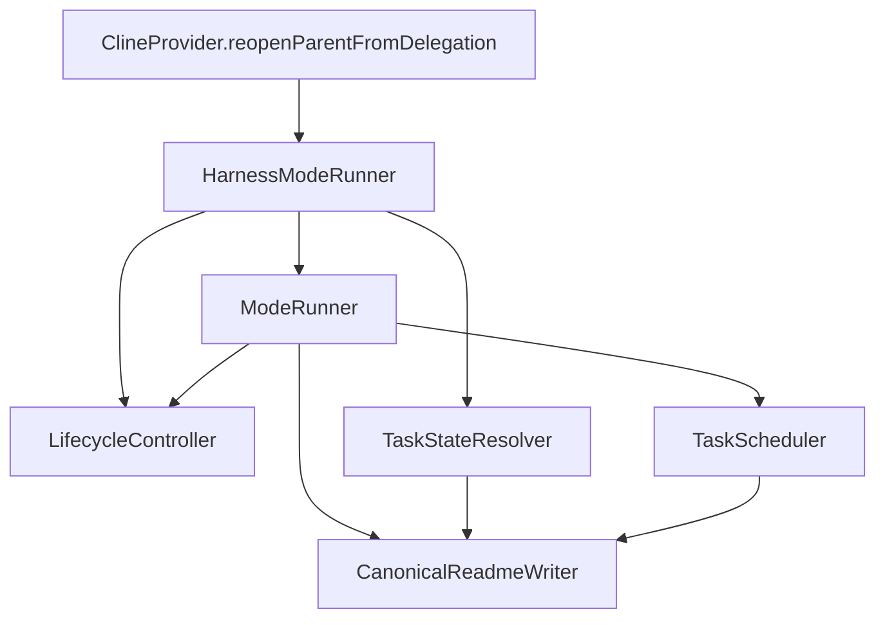

# Harness stage lifecycle model

This document describes the programmatic stage lifecycle that runs a task through its modes
(`architect` → `code` → `refactor` → `reviewer` → `qa`) without asking the model to choose the next
stage. It is a different model from the one in
[`docs/architecture/task-lifecycle-model.md`](task-lifecycle-model.md): that model covers the
persisted `HistoryItem` status of a _task record_ (active / delegated / completed / interrupted)
and is checked by `pnpm lifecycle:model-check`. This model covers the `Status` line of the task
README, which the modes act on. The two are connected only through
`ClineProvider.reopenParentFromDelegation`, which forks between them.

## Layers

| Layer           | Location                                                                                         | Responsibility                                                                                                   |
| --------------- | ------------------------------------------------------------------------------------------------ | ---------------------------------------------------------------------------------------------------------------- |
| Integration     | [`ClineProvider.reopenParentFromDelegation`](../../src/core/webview/ClineProvider.ts:4415)       | After a subtask child completes, delegate the next stage. Falls back to the legacy parent resume on any failure. |
| Adapter         | [`src/core/harness/mode-runner.ts`](../../src/core/harness/mode-runner.ts:21)                    | Resolve the runtime `TaskContext`, parse the stage report, call the controller, apply the decision.              |
| Domain          | [`packages/core/src/lifecycle`](../../packages/core/src/lifecycle/index.ts:1)                    | Pure routing (`LifecycleController`), effects (`ModeRunner`), protocol parsing (`parseStageOutcome`).            |
| Canonical state | [`packages/core/src/worktree/task-state.ts`](../../packages/core/src/worktree/task-state.ts:36)  | The status vocabulary and the canonical transition table.                                                        |
| Canonical I/O   | [`packages/core/src/worktree/task-readme.ts`](../../packages/core/src/worktree/task-readme.ts:1) | The only writer of the harness-owned README block.                                                               |

## The model has two halves, and they must agree

A stage outcome is only actioned when **both** halves agree:

1. **Preconditions** — `MODE_STATUSES` in [`lifecycle-controller.ts`](../../packages/core/src/lifecycle/lifecycle-controller.ts:24)
   answers "may this mode complete the status the README is currently in?".
2. **Canonical transitions** — `TASK_STATUS_TRANSITIONS` in [`task-state.ts`](../../packages/core/src/worktree/task-state.ts:36)
   answers "is the status we are about to write reachable from the current one?".

`LifecycleController.transition` validates every status it writes against the canonical table before
returning a decision, and a decision that re-writes the current status is treated as a no-op (the
runner skips the file write) instead of inventing self-loop edges. This is the invariant that keeps
the two halves from drifting:

> No status reaches the README unless it is an edge in `TASK_STATUS_TRANSITIONS`.

`schedule_implementation` is deliberately exempt: it defers the write to `TaskScheduler`, which
re-derives `IMPLEMENTATION` from the DAG after checking the status is an implementation stage.

Three edges exist only to close remediation loops, and they are the part of the table that is easy to
lose:

| Marker status | Written by                                      | Returns to                      | Meaning                                |
| ------------- | ----------------------------------------------- | ------------------------------- | -------------------------------------- |
| `REVIEW`      | reviewer `REQUIRED` / `PRODUCTION_FIX_REQUIRED` | `READY_FOR_REVIEW` → reviewer   | a fix pass is running; re-review it    |
| `REFACTOR`    | refactor `FUNCTIONAL_DEFECT`                    | `READY_FOR_REFACTOR` → refactor | a fix pass is running; re-refactor it  |
| `QA_READY`    | qa `FAILED`                                     | `REVIEW_PASSED` → qa            | a fix pass is running; re-verify in QA |

## Stage decisions

| Current status                   | Mode      | Outcome                               | Decision                                                                                                                      |
| -------------------------------- | --------- | ------------------------------------- | ----------------------------------------------------------------------------------------------------------------------------- |
| `ANALYSIS`                       | architect | `COMPLETED`                           | `schedule_implementation` → `READY_FOR_IMPLEMENTATION`                                                                        |
| `IMPLEMENTATION`                 | code      | `COMPLETED`                           | `schedule_implementation` → scheduler assigns the next ready unit, or `READY_FOR_REFACTOR` + refactor when every unit is done |
| `READY_FOR_REFACTOR`, `REFACTOR` | refactor  | `COMPLETED`                           | `READY_FOR_REVIEW` + reviewer                                                                                                 |
| `READY_FOR_REFACTOR`, `REFACTOR` | refactor  | `FUNCTIONAL_DEFECT`                   | `REFACTOR` + code (fix pass)                                                                                                  |
| `READY_FOR_REVIEW`, `REVIEW`     | reviewer  | `PASSED`                              | `REVIEW_PASSED` + qa                                                                                                          |
| `READY_FOR_REVIEW`, `REVIEW`     | reviewer  | `REQUIRED`, `PRODUCTION_FIX_REQUIRED` | `REVIEW` + code (fix pass)                                                                                                    |
| `REFACTOR`, `REVIEW`, `QA_READY` | code      | `COMPLETED`                           | re-enters the requesting stage: `READY_FOR_REFACTOR` + refactor, `READY_FOR_REVIEW` + reviewer, or `REVIEW_PASSED` + qa       |
| `REVIEW_PASSED`, `QA_READY`      | qa        | `PENDING`                             | stop at `QA_READY` (waiting for the user)                                                                                     |
| `REVIEW_PASSED`, `QA_READY`      | qa        | `PASSED`                              | stop at `DONE`                                                                                                                |
| `REVIEW_PASSED`, `QA_READY`      | qa        | `FAILED`                              | `QA_READY` + code (fix pass)                                                                                                  |
| any owned status                 | any       | `BLOCKED`                             | stop at `BLOCKED`                                                                                                             |

A fix pass never enters the implementation DAG: the status stays on the requesting stage's marker,
so `TaskScheduler.assignNext` refuses to assign a unit (it only assigns for implementation stages)
and the Code child works from the requesting stage's report instead of silently picking up unrelated
work.

## The report protocol

A stage reports its semantic outcome with exactly one `Stage Result: <RESULT>` line. The marker is
the exported constant `STAGE_RESULT_MARKER`, and both sides are derived from it: the instruction
`ModeRunner` sends and the pattern `parseStageOutcome` matches. The mode itself is never taken from
the reply — it comes from the runtime child history — so a model cannot route the lifecycle.

Parsing is deliberately strict: an unknown mode, an unknown result, a missing marker, or more than
one marker line all yield `null`, which sends the caller down its pre-existing parent-resume path.

## Failure semantics

Everything that can go wrong degrades to the legacy behaviour instead of failing the task:

| Failure                                                    | Result                                                                |
| ---------------------------------------------------------- | --------------------------------------------------------------------- |
| Not a lifecycle mode, or no unambiguous report             | `HarnessModeRunner.run` returns `null`; the parent resumes as before. |
| Mode/status mismatch, or a non-canonical status transition | `invalid`; the parent resumes as before.                              |
| Selected mode is not configured                            | `startMode` throws `LifecycleError`; the parent resumes as before.    |
| README has no canonical `Status` line                      | `LifecycleError`; the parent resumes as before.                       |
| Scheduler cannot produce a next stage                      | `invalid`; the parent resumes as before.                              |

## Where the invariants are enforced

| Invariant                                                 | Enforced by                                                                                                                              |
| --------------------------------------------------------- | ---------------------------------------------------------------------------------------------------------------------------------------- |
| No status is written outside `TASK_STATUS_TRANSITIONS`    | `LifecycleController.transition`                                                                                                         |
| A mode only completes a status its stage owns             | `MODE_STATUSES` precondition check                                                                                                       |
| Every status a mode claims can actually be routed         | controller spec, `claims only stage/status pairs that can actually be routed`                                                            |
| Every decision the cross-product can produce is canonical | controller spec, `only ever writes canonical task status transitions`                                                                    |
| The instruction and the parser agree on the marker        | `packages/core/src/lifecycle/__tests__/mode-runner.spec.ts`, `asks the stage for the outcome marker the parser reads back`               |
| Only one writer mutates the README block                  | `CanonicalReadmeWriter` is the sole read-modify-write path for `ModeRunner`; `TaskScheduler` uses the same field writer and atomic write |

## Known limitation

`Next Step` is owned by `TaskScheduler` when it assigns an implementation unit; the lifecycle writes
only `Status` and `Current Task`, so after a stage move the remaining `Next Step` text can describe
work that has already happened (for example `Implement T02 (...)` while the status is `DONE`). No
production consumer reads the field today — it is a human-facing pointer in the README — so refreshing
it belongs to a deliberate wording decision rather than to this model. If you do refresh it, do it in
`ModeRunner` through the shared field writer and keep the wording status-derived.

## Extending the model

- **New edge between stages** — add it to `TASK_STATUS_TRANSITIONS` and update the controller spec
  table. The cross-product guard will fail until the decision is written.
- **New stage outcome** — add the result to `STAGE_RESULTS`, handle it in `LifecycleController.decide`
  (the exhaustive `switch` makes an unhandled result a type error), then extend the spec tables.
- **New canonical README field** — add it to `CANONICAL_README_FIELDS` in `task-readme.ts` so both
  writers stay consistent, and pass it explicitly from each caller.
- **New stage** — add the mode to `LIFECYCLE_MODES` and give it a row in `MODE_STATUSES`. The
  routability guard requires at least one real outcome to be handled for every claimed status.

Do not add a second writer for the README block or a second source of transition truth; the drift
guards exist because the two halves of this model were previously maintained separately.
